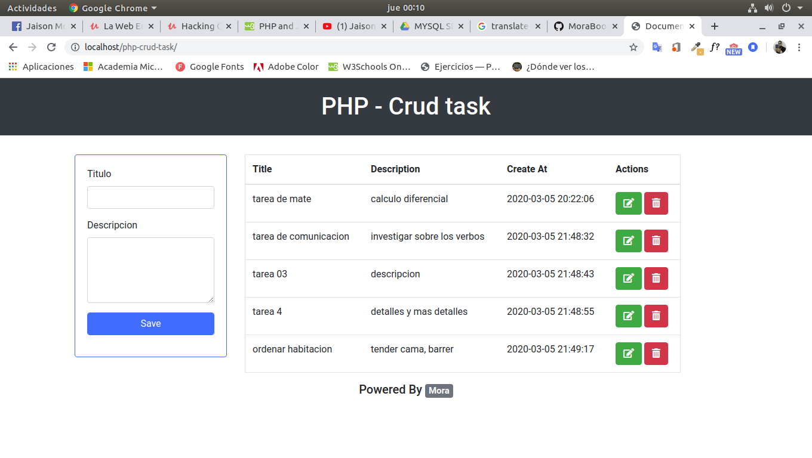

# Aplicacion de tareas
Aplicacion basica y minimalista para almacenar tareas, con las siglas CRUD. Un ejemplo practico y base como guia

### Tecnologias
Las tecnologias que usaremos para este sistema son:

* PHP: POO
* MySQL
* Bootstrap

### Requisitos 
Contar con server como LAMP, WAMP o contar con un simulador como XAMMP

### Ejecutar Proyecto

**Paso 1**
Creamos la base de datos con el nombre myTasks
```
mysql> create database myTasks;
```

Importamos la estructura y los registro con el siguiente codigo
```
mysql -u root -p 'myTasks' < filename.sql
```

Luego de estos dos pasos ya tendremos la estructura y los datos de la base de datos.

**Paso 2**
En el caso de usar LAMP Server clonar la aplicacion en la siguiente ubicacion:
```
cd /var/www/html/
```

Si estamos en windows y usamos XAMMP clonamos dentro de la carpeta C:Xammp/htdocs/

Usamos el siguiente comando para clonar la aplicacion

```
git clone https://github.com/MoraBoop/php-crud-task.git
```

Por ultimo dirigirnos al host local y usar la ruta de acceso: localhost:php-crud-task/


